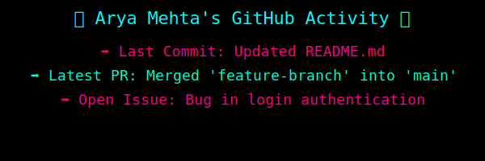

  

<h1 align="center">Arya Mehta</h1>

Building scalable AI systems and production-grade ML architectures.

---

## About

AI Engineer focused on:

- Applied Machine Learning
- LLM Integration & Autonomous Systems
- Backend API Architecture
- MLOps & Model Deployment

Contact: **aryamehta0302@gmail.com**

---

## Core Tech Stack

---

## Engineering Focus

| Domain | Expertise |
|--------|------------|
| AI & ML | NLP, Transformers, CNNs, Model Deployment |
| Backend Systems | FastAPI, Node.js, REST APIs |
| MLOps | Docker, Azure, CI/CD |
| Databases | MySQL, MongoDB |
| Frontend | React |

---

## Resume

  

---

## Featured Projects

  
  

---

## GitHub Analytics

  

  
  

  

---

## Live Activity Panel

  

---

## Now Playing

<!-- RANDOM_SONG -->
🎧 **Now Playing:** https://youtu.be/fLexgOxsZu0

---

## Contribution Graph

  

---

## Contribution Snake

  

---

Focused on shipping real AI systems.

