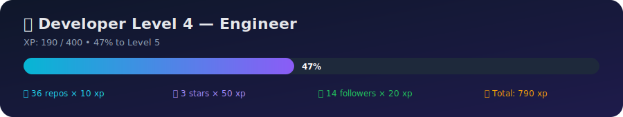
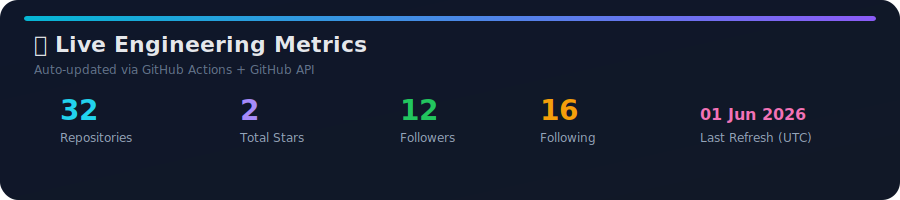
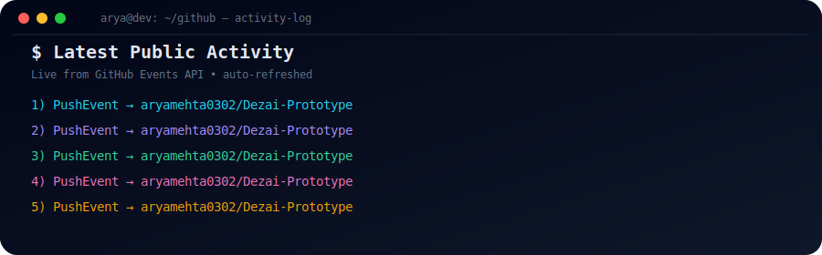

<!-- ANIMATED HEADER -->
<p align="center">
  
</p>

<!-- MARIO CODING GIF -->
<p align="center">
  
</p>

<!-- CTA BADGES -->
<p align="center">
  <a href="mailto:aryamehta0302@gmail.com"></a>
  <a href="https://github.com/aryamehta0302?tab=repositories"></a>
  <a href="https://raw.githubusercontent.com/aryamehta0302/aryamehta0302/main/resume.pdf"></a>
</p>

<!-- LIVE COUNTERS -->
<p align="center">
  
  
  
</p>


<!-- TERMINAL ABOUT -->
## 🧑‍💻 About Me

```zsh
arya@dev:~$ cat about.yaml
```

```yaml
name: Arya Mehta
role: AI Engineer & ML Systems Builder
location: India
education: B.Tech in AI & Machine Learning

currently_building: Production-grade LLM integration systems
learning: Advanced MLOps, Model Optimization, AI Agent Design

interests:
  - Autonomous AI Agents & Multi-Agent Systems
  - Model Serving & Inference Optimization
  - Data-Driven API Architecture (FastAPI)
  - MLOps & CI/CD for ML Pipelines

open_to: AI/ML open-source collaborations
fun_fact: "I debug models like detectives solve cases — patience and too much coffee"
```


<!-- LIVE DEVELOPER DASHBOARD -->
## ⚡ Live Developer Dashboard

<p align="center">
  
</p>

<p align="center">
  
</p>

<p align="center">
  
</p>

<details>
<summary>📊 <b>Raw Metrics</b> (auto-updated every 12 hours)</summary>
<br>

<!-- DYNAMIC_METRICS_START -->
- 🚀 **Public repositories:** 27
- ⭐ **Total stars earned:** 1
- 👥 **Followers:** 6  |  **Following:** 3
- 🕒 **Last refresh:** 11 Mar 2026, 18:47 UTC
<!-- DYNAMIC_METRICS_END -->

</details>


<!-- TECH STACK -->
## 🧰 Tech Arsenal

### 🤖 AI & Machine Learning

<p align="center">
  
  <br/><br/>
  
  
  
  
  
  
</p>

### ⚙️ Backend & APIs

<p align="center">
  
</p>

### 🌐 Frontend

<p align="center">
  
</p>

### 🗄️ Databases

<p align="center">
  
</p>

### ☁️ DevOps & Cloud

<p align="center">
  
</p>

### 💻 Programming Languages

<p align="center">
  
</p>


<!-- FEATURED PROJECTS -->
## 📌 Featured Projects

<p align="center">
  <a href="https://github.com/aryamehta0302/AIML-Department-chatbot">
    
  </a>
  <a href="https://github.com/aryamehta0302/AI-OPS">
    
  </a>
</p>

<!-- RANDOM_PROJECT_START -->
### 🎲 Dynamic Project Spotlight
- **[AI-OPS](https://github.com/aryamehta0302/AI-OPS)**
- **Stack:** Python  |  **Stars:** 0
- **Summary:** No description available.
<!-- RANDOM_PROJECT_END -->


<!-- GITHUB ANALYTICS -->
## 📊 GitHub Analytics

<div align="center">
  
  
</div>

<br/>

<p align="center">
  
</p>

<p align="center">
  
</p>

<div align="center">
  
</div>

<br/>

<div align="center">
  
  
</div>


<!-- TROPHIES -->
## 🏆 GitHub Trophies

<p align="center">
  
</p>


<!-- CONTRIBUTION SNAKE -->
## 🐍 Contribution Snake

<p align="center">
  
</p>


<!-- DYNAMIC SECTIONS -->
## 🧪 Weekly Build Summary

<!-- WEEKLY_SUMMARY_START -->
- ✅ Push events (7d): **2**
- 🔀 Pull request events (7d): **0**
- 🐞 Issue events (7d): **0**
- 🧭 Repositories touched (7d): **1**
<!-- WEEKLY_SUMMARY_END -->

---

## 📰 Latest Writing & Dev Notes

<!-- BLOG_POSTS_START -->
- 🔭 [aryamehta0302](https://github.com/aryamehta0302/aryamehta0302) — latest repo activity
- 🔭 [movie](https://github.com/aryamehta0302/movie) — latest repo activity
- 🔭 [CARD](https://github.com/aryamehta0302/CARD) — latest repo activity
<!-- BLOG_POSTS_END -->

---

## 💡 AI Daily Quote

<!-- DAILY_QUOTE_START -->
> _Ship fast, but ship with tests. Move fast, but leave docs behind._
<!-- DAILY_QUOTE_END -->

---

## 🧪 Weekly Build Summary

<!-- WEEKLY_SUMMARY_START -->
- ✅ Push events (7d): 0
- 🔀 Pull request events (7d): 0
- 🐞 Issue events (7d): 0
- 🧭 Repositories touched (7d): 0
<!-- WEEKLY_SUMMARY_END -->

---

## 🎧 Coding Playlist

<!-- RANDOM_SONG -->
🎧 **Now Playing:** https://youtu.be/dQw4w9WgXcQ

---

<!-- ANIMATED FOOTER -->
<p align="center">
  
</p>
