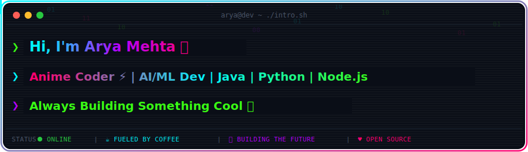

  

<h1 align="center">Arya Mehta</h1>

  <b>AI Engineer • ML Systems Builder • LLM + MLOps Focused</b>

  Building production-grade intelligent systems with strong backend architecture, measurable impact, and clean developer experience.

  
  
  

  

---

## ⚡ Live Developer Snapshot

  

  

<!-- DYNAMIC_METRICS_START -->
- 🚀 **Public repositories:** 27
- ⭐ **Total stars earned:** 1
- 👥 **Followers:** 6  |  **Following:** 3
- 🕒 **Last refresh:** 11 Mar 2026, 18:17 UTC
<!-- DYNAMIC_METRICS_END -->

---

## 🧠 About

- Building AI-native products with FastAPI, Python, and modern ML tooling.
- Focused on reliable LLM integration, data-driven APIs, and deployable ML workflows.
- Interested in autonomous systems, model serving optimization, and practical AI UX.

---

## 🧰 Tech Stack

---

## 📌 Featured Projects

<!-- RANDOM_PROJECT_START -->
### 🎲 Dynamic Project Spotlight
- **[AI-OPS](https://github.com/aryamehta0302/AI-OPS)**
- **Stack:** Python  |  **Stars:** 0
- **Summary:** No description available.
<!-- RANDOM_PROJECT_END -->

---

## 📊 Engineering Analytics

  
  

  

  

  

---

## 🐍 Contribution Snake

  

---

## 📰 Latest Writing & Dev Notes

<!-- BLOG_POSTS_START -->
- 🔭 [aryamehta0302](https://github.com/aryamehta0302/aryamehta0302) — latest repo activity
- 🔭 [movie](https://github.com/aryamehta0302/movie) — latest repo activity
- 🔭 [CARD](https://github.com/aryamehta0302/CARD) — latest repo activity
<!-- BLOG_POSTS_END -->

---

## 💡 AI Daily Quote

<!-- DAILY_QUOTE_START -->
> Automation is a force multiplier for consistent engineering quality.
<!-- DAILY_QUOTE_END -->

---

## 🧪 Weekly Build Summary

<!-- WEEKLY_SUMMARY_START -->
- ✅ Push events (7d): 0
- 🔀 Pull request events (7d): 0
- 🐞 Issue events (7d): 0
- 🧭 Repositories touched (7d): 0
<!-- WEEKLY_SUMMARY_END -->

---

## 🎧 Coding Playlist

<!-- RANDOM_SONG -->
🎧 **Now Playing:** https://youtu.be/dQw4w9WgXcQ

---

  <i>Designing intelligent systems that are fast, useful, and production-ready.</i>

